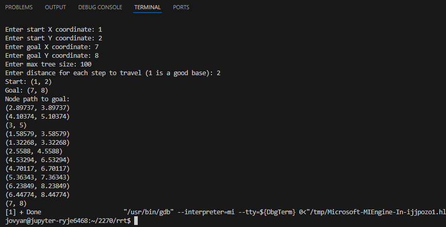
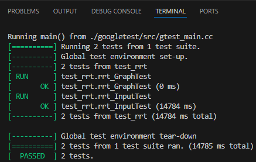

# Tree Data Structure with Rapidly Exploring Random Tree Demo

## Introduction
RRT is a generally effective algorithm for pathfinding from a start point to a goal point. It is commonly used to guide robots by discovering a viable path through an unknown configuration space. This version of RRT, while effective, is often not optimal. There is also an optimized version of this algorithm (RRT*) that will replace branches in the tree with more optimal paths once a region of the space is more fully explored. By comparison, the base RRT is almost certain not to return the optimal path to the goal. However, it does require less overhead than RRT*.

## Features
### Tree Data Structure
- Insert
- Search

### User Facing for RRT
- Enter starting coordinates
- Enter goal coordinates
- Enter step size
- Enter tree size (maximum)

## How the Data Structure Works
The tree data structure is a collection of nodes that have parents and may have children. These nodes may contain any useful data. It has the attribute that a path to the root of the tree can be found from any child of the tree using the parent of each child. This is important for the RRT, because the final calculation is a path from the node that has "found" the goal back through the tree to the starting point, the root.

### Time and Space Complexity
#### Data Structure
| Binary Tree | Average Case | Worst Case |
|-------------|--------------|------------|
| Insert      | O(log(n))    | O(n)       |
| Search      | O(log(n))    | O(n)       |
| Delete      | O(log(n))    | O(n)       |

#### Algorithm
| RRT         | Time       | Space |
|-------------|------------|-------|
| Computation | O(nlog(n)) | O(n)  |

#### Explanation
RRT has a time complexity of O(nlog(n)) for processing, O(n) for query, and a space complexity of O(n) ([source, p.5](https://arxiv.org/pdf/1105.1186)). Considering that searching a binary search tree (BST) averages a time complexity of O(logN), it follows that RRT would have a complexity of O(NlogN) due to the search being conducted after every addition of a node.

## File Structure
```
/src            # Source code & Header files
/tests          # Test cases
/app/main.cpp   # Demo application
```

## Installation / Setup
This project was developed and tested in the CU JupyterHub environment. It should be possible to compile and run the project in JupyterHub by cloning this repo.

In JupyterHub:
```bash
git clone https://github.com/rjennett/rrt.git
cd rrt
```
- Open the project directory rrt/ in VSCode
- The included .vscode/ files will allow running the project from the "Run and Debug" tab.
- From the VSCode run dropdown
    - Run App to run the demo in the CLI
    - Run Tests to run the test cases


## Usage
When running the app, the user will be prompted to enter six values:
- startX: Value for the root of the tree to begin at (X)
- startY: Value for the root of the tree to begin at (Y)
- goalX: Value for the graph to pursue discovering (X)
- goalY: Value for the graph to pursue discovering (Y)
- max nodes: The max number of nodes for the tree to create while searching
- step distance: The linear distance for each new node to move away from an existing node

The app will return a failure message if the tree does not encounter the goal coordinate within the provided number of node extensions.

The app will print out the coordinates of the nodes that lead to the goal if the goal was found.

## Demonstration of the Project Running
The following links are to the raw data of two screen recordings in this repo. They must be downloaded for viewing due to GitHub hosting limitations. They demonstrate the real-time use of this application in a successful and unsuccessful search.
- [RRT Run Success](img/RRT_RunSuccess.mp4)
- [RRT Run Failure](img/RRT_RunFailure.mp4)

This screenshot demonstrates the full input and output of the application. The user entered a Start XY of (1, 2) and a Goal XY of (7, 8). The fully random nature of RRT makes it prone to failing if the tree is not allowed to be large enough or the step size does not allow it to traverse far enough. The two combine to determine how far the tree can explore. This demonstration used a tree size of 100 nodes and step size of 2. Increasing step size seems to increase the likelihood of finding the goal with fewer nodes. However, this is a tradeoff with maneuverability of the tree.


## Testing
This screenshot demonstrates a successful test run output. As noted in the test comments, the test for the main application is prone to failing in the same ways as mentioned above. The test serves more as an automation of passing the six required inputs than as a test of the algorithm directly, due to it being non-deterministic. If this implementation were more fleshed out, we may want to use this test to ensure a certain level of service from the search. With a more robust search, it may be possible to set an expectation that it should only require so many resources to find the goal, or should never fail. In that situation, more useful and detailed tests could be written.


## Development Decisions
This implementation was developed around a graph data structure. It uses a simplified graph, because not all of the functionality of a fully implemented graph is necessary here. Nodes must be added, store coordinate information, and have access to their predecessors. 

This program was heavily structured around the pseudocode for RRT found [here](https://en.wikipedia.org/wiki/Rapidly_exploring_random_tree) and using this [project description](https://www.youtube.com/watch?v=OXikozpLFGo) as reference.

A big conceptual shift happened late in the project. I had originally belived that I would need a 2d array to serve as the configuration space in which the tree would be searching. There were a lot of issues with that, especially if the user was allowed to configure the size of the space. It wasn't until later that I realized that the goal could be anywhere. Much the same way a graph or tree has a visualization only if you make one, the configuration space didn't actually need to have a structured existence. The coordinates bounding the generation of the search points simply needed to include the goal set by the user. This allowed the removal of a lot of 2d array definition and passing around the program and simplified things nicely. In reality, there would probably be a polygonal boundary within which the algorithm would operate. This would be managed similar to how I propose obstacles would be managed below. Instead of ensuring points are not contained, ensuring that they are contained. In this way, even a non-convex problem space can be navigated by RRT.

The implementation here iterates a simple vector of the nodes, in the order they were created, to search for nearest nodes to the randomly selected point qRand. Even though trees have many established advanced search algorithms, I don't believe the RRT search for nearest node would benefit from them. Since the next point is random, it is always equally possible that the whole tree will have to be searched. 

## Future Improvements
RRT should normally be able to handle navigating around obstacles. Given what I have so far, I believe I have an idea of how I would implement this functionality. Obstacles would be stored as a list of boundary coordinates. When a random point is generated, a check would occur to see if the point was within an obstacle space: `(qNewX < boundMinX || qNewX > boundMaxX || qNewY < boundMinY || qNewY > boundMaxY)` ([source](https://stackoverflow.com/questions/217578/how-can-i-determine-whether-a-2d-point-is-within-a-polygon)). If it is, the boundary of the obstacle should be iterated and the point moved to the nearest edge of the obstacle. This would function similarly to the method that searches the tree for the nearest point to the randomly chosen point.

## References
- RRT Overview and Pseudocode Reference: https://en.wikipedia.org/wiki/Rapidly_exploring_random_tree
- RRT Overview & Implementation Reference: https://www.youtube.com/watch?v=OXikozpLFGo
- Algorithm Complexity: https://arxiv.org/pdf/1105.1186